# Daksh Babbar | Portfolio — Project Brief & Technical Overview

> **Project Title:** Daksh Babbar Portfolio Website  
> **Type:** Interactive 3D/Motion Scrollytelling & Full-Stack Portfolio  
> **Author:** Daksh Babbar (Creative Developer & Motion Designer)  
> **Status:** Production Ready  

---

## 1. Executive Summary

This project is a high-performance, visually immersive personal portfolio website built for **Daksh Babbar**, a Creative Developer and Motion Designer. It bridges the gap between software engineering and cinematic visual design by pairing high-performance interactive web technologies (**Next.js 14, React 18, TypeScript, Tailwind CSS, Framer Motion, HTML5 Canvas**) with curated motion graphics assets (**192-frame rendered 3D image sequences, After Effects showreels, kinetic typography, and SaaS UI animations**).

The website serves as a single-page interactive showcase featuring:
1. An Apple-style **Scrollytelling 3D Frame Sequence** locked to the user's scroll.
2. An overlay system of narrative statements synchronized to scroll depth.
3. A **Featured Projects** showcase for full-stack web and AI applications.
4. An interactive **Motion Graphics & Video Gallery** with an integrated universal Lightbox video player.
5. An **About Me** section highlighting the creative philosophy.
6. A **Contact & Connect** section with direct email triggers and professional links.
7. A smart, auto-hiding floating glassmorphism **Navigation Bar**.

---

## 2. Technology Stack & Specifications

### 2.1 Core Framework & Runtime
- **Next.js 14 (App Router)** (`14.2.35`): Utilized for modern React Server Components, client-side rendering boundaries (`"use client"`), optimized metadata management, asset serving, and build tooling.
- **React 18** (`^18.x`): Component architecture, lifecycle hooks (`useEffect`, `useState`, `useRef`, `useCallback`).
- **TypeScript 5** (`^5.x`): End-to-end type safety across data structures (`Project`, `VideoProject`, embed parameters) and DOM/Canvas event handlers.
- **Node.js & npm**: Runtime environment and package management.

### 2.2 Styling & Design System
- **Tailwind CSS 3.4** (`^3.4.1`): Utility-first CSS framework providing responsive grid layouts, custom dark backgrounds (`#050505`, `#0a0a0a`, `#121212`), custom purple accent glow highlights (`purple-400`, `purple-500/10`), and glassmorphic blur effects (`backdrop-blur-md`, `bg-white/5`).
- **PostCSS & Autoprefixer** (`^8.x`): Automated CSS post-processing and cross-browser vendor prefixing.
- **Geist Variable Fonts** (`next/font/local`): High-definition modern typography with `GeistSans` and `GeistMono`.
- **clsx & tailwind-merge** (`^2.1.1` / `^3.5.0`): Dynamic class concatenation and utility conflict resolution.

### 2.3 Motion, Canvas & Media
- **Framer Motion 12** (`^12.34.3`):
  - Scroll-linked animation drivers (`useScroll`, `useTransform`, `useMotionValueEvent`).
  - Viewport-triggered entrance animations (`whileInView`, `initial`, `transition`).
  - Smooth exit/entry modal animations (`AnimatePresence`).
- **HTML5 2D Canvas API**: High-performance canvas drawing context (`getContext("2d")`) configured for High-DPI screens (`window.devicePixelRatio`) with high-quality image smoothing.
- **Lucide React** (`^0.575.0`): Scalable UI icons (`Play`, `X`, `Clock`, `Film`).
- **Sharp** (`^0.35.4`): Next.js image optimization pipeline.

---

## 3. Project Architecture & Directory Structure

```
Portfolio/
├── public/                               # Static media and assets
│   ├── sequence/                         # 192 WebP frames (frame_000 to frame_191) for Scrollytelling
│   ├── videos/                           # MP4 video files & high-resolution thumbnail images
│   │   ├── Final Reel-.mp4               # Motion Graphics Showreel
│   │   ├── SAAS Animation.mp4            # SaaS Product & UI Animation
│   │   ├── Final Logo Animation.mp4      # Kinetic Logo Reveal
│   │   ├── reel_thumb.jpg
│   │   ├── saas_thumb.jpg
│   │   └── logo_thumb.jpg
│   ├── Image About me.png                # About section portrait asset
│   ├── prep-ai-bg.jpeg                   # PrepAI project banner
│   ├── employee_management.jpg           # Asset & Leave system preview
│   └── stripe_revenue.jpg                # Stripe SaaS preview
│
├── src/
│   ├── app/
│   │   ├── fonts/                        # GeistVF and GeistMonoVF font binaries
│   │   ├── globals.css                   # Custom global scrollbars, base styles, CSS variables
│   │   ├── layout.tsx                    # Root layout with SEO metadata & floating Navbar
│   │   └── page.tsx                      # Main single-page application orchestrator
│   │
│   └── components/
│       ├── Navbar.tsx                    # Floating pill navigation with directional scroll hide/show
│       ├── ScrollyCanvas.tsx             # 500vh sticky 2D Canvas with frame preloading & smooth playback
│       ├── Overlay.tsx                   # Synchronized scroll-driven text overlays
│       ├── Projects.tsx                  # Grid showcase for full-stack web applications
│       ├── VideoWorks.tsx                # Video gallery with interactive Lightbox player modal
│       ├── About.tsx                     # Narrative bio with viewport motion reveal
│       └── Contact.tsx                   # Call-to-action, direct email trigger & footer
│
├── .eslintrc.json                        # ESLint configuration
├── next.config.mjs                       # Next.js configuration
├── package.json                          # Dependencies & NPM scripts
├── postcss.config.mjs                    # PostCSS configuration
├── tailwind.config.ts                    # Tailwind theme extension & content paths
└── tsconfig.json                         # TypeScript compiler configuration
```

---

## 4. End-to-End System & User Flow

```mermaid
flowchart TD
    Start([User Opens Portfolio]) --> LoadLayout[Root Layout Loads Fonts & Metadata]
    LoadLayout --> MountNavbar[Navbar Mounts Fixed at Top]
    
    subgraph Scrollytelling [1. Hero Scrollytelling Section - 500vh]
        MountCanvas[ScrollyCanvas Mounts & Renders Frame 0]
        MountCanvas --> PreloadBatches[Preload Priority Chunk 1-30 & Stagger 31-191]
        UserScrolls[User Scrolls Down Track]
        UserScrolls --> TransformFrame[Framer Motion maps scroll 0-100% to Frame Index 0-191]
        TransformFrame --> RenderCanvas[Canvas renders target/closest loaded frame]
        UserScrolls --> TransformOverlay[Overlay interpolates Opacity & TranslateY for text slides]
    end

    subgraph ContentSections [2. Content & Interactivity]
        Scrollytelling --> ProjectsSec[Projects Section: Full-Stack & AI Apps with Live/Code Links]
        ProjectsSec --> VideoSec[VideoWorks Section: Motion Graphics Cards]
        VideoSec --> ClickVideo{User clicks a video card?}
        ClickVideo -- Yes --> OpenModal[Universal Lightbox Opens: Direct MP4 / YouTube / Vimeo]
        ClickVideo -- No --> AboutSec[About Section: Animated Bio & Portrait]
        OpenModal --> CloseModal[User Closes Modal] --> AboutSec
        AboutSec --> ContactSec[Contact Section: Send Email CTA & LinkedIn Link]
    end

    subgraph NavLogic [3. Floating Navbar Dynamics]
        ScrollEvent[User Scrolls Anywhere]
        ScrollEvent --> ScrollDirection{Scroll Direction?}
        ScrollDirection -- Down (>150px) --> HideNav[Navbar Slides Up: -100%]
        ScrollDirection -- Up --> ShowNav[Navbar Slides Down: 0%]
        ScrollEvent --> ScrolledPast50{Scrolled > 50px?}
        ScrolledPast50 -- Yes --> GlassNav[Add Dark Glassmorphic Blur Backdrop]
        ScrolledPast50 -- No --> TransNav[Transparent Backdrop]
    end
```



---

## 5. Detailed Component Breakdown & Implementation Mechanics

### 5.1 `ScrollyCanvas.tsx` — High-Performance Scrollytelling Engine
- **Container Height:** `500vh` providing an extended scroll track while keeping the `<canvas>` fixed with `sticky top-0 h-screen`.
- **Frame Interpolation:** Uses Framer Motion's `useScroll` target and `useTransform(scrollYProgress, [0, 1], [0, 191])` to calculate the exact frame matching the current scroll offset.
- **Smart Image Preloading Strategy:**
  1. **Instant Frame 0:** Loads and draws `frame_000` immediately to eliminate any initial render blank screen.
  2. **Early Priority Batch:** Preloads frames 1 to 30 immediately for instant smooth scroll response.
  3. **Staggered Background Chunks:** Loads remaining frames (31 to 191) asynchronously in chunks of 20 with `setTimeout(80ms)` to prevent network congestion.
- **Closest-Frame Fallback Algorithm:** If a user scrolls faster than frame downloads, `renderClosestFrame(targetIdx)` executes an outward bidirectional search (`offset = 1...frameCount`) to immediately paint the nearest cached frame, eliminating flicker.
- **DPR Scaling & Letterboxing:** Adjusts for device pixel ratio (`Math.min(window.devicePixelRatio, 2)`) and calculates aspect-ratio math to fit/cover images cleanly without distortion.

### 5.2 `Overlay.tsx` — Synchronized Scroll Typography
- Sits with `pointer-events-none` directly over the `500vh` canvas container.
- Uses `useTransform` to fade in, float up (`y: 40 -> -80`), and fade out three distinct narrative blocks:
  - **Slide 1 (0% – 22%):** Name title (*Daksh Babbar*) and role (*Creative Developer & Motion Designer*).
  - **Slide 2 (22% – 58%):** Core statement (*"I build digital experiences."*).
  - **Slide 3 (58% – 92%):** Mission statement (*"Bridging design and engineering."*).
  - **Scroll Indicator (0% – 6%):** Animated mouse pill indicator that fades out as soon as the user starts scrolling.

### 5.3 `Projects.tsx` — Featured Full-Stack Projects
- Displays structured data for production software applications:
  - **PrepAI:** AI-powered resume builder, ATS optimizer, and career roadmap generator (`React`, `Tailwind CSS`, `API key Integration`).
  - **Employee Asset & Leave Management System:** Full-stack enterprise portal with role-based workflows and auth (`MERN`, `JWT`, `Multer`).
  - **Stripe Revenue Management SaaS:** Subscription billing platform with automated revenue distribution and webhooks (`MERN`, `Stripe`, `JWT`).
- Interactive card design with hover micro-animations (`hover:-translate-y-2`, glowing borders, badge pill lists, and external link icons).

### 5.4 `VideoWorks.tsx` — Motion Graphics & Universal Video Lightbox
- Features motion design deliverables:
  - **Motion Graphics Showreel** (*After Effects, VFX, Kinetic Type*)
  - **SaaS Product & UI Animation** (*UI Motion, Figma to AE, Promo*)
  - **Kinetic Logo Reveal** (*3D Motion, Brand Identity*)
- **Universal Embed Detection (`getEmbedInfo`):**
  - Detects YouTube URLs via regex and transforms them into autoplaying embed iframes.
  - Detects Vimeo URLs via regex and formats Vimeo player embeds.
  - Handles direct local video files (`/videos/*.mp4`) using HTML5 `<video controls autoPlay playsInline>`.
- **Lightbox Player:** Uses Framer Motion's `<AnimatePresence>` to create a backdrop-blurred modal with backdrop-click-to-dismiss and escape accessibility.

### 5.5 `About.tsx` & `Contact.tsx` — Narrative & Conversion
- **About Section:** Dual-column layout featuring portrait photography with dark gradient fade overlays and a creative developer narrative. Uses Framer Motion's `whileInView={{ opacity: 1, x: 0 }}` for smooth slide-in transitions.
- **Contact Section:** Clean Call-To-Action with high-contrast pill buttons for `mailto:dakshbabbar3131@gmail.com` and LinkedIn profile, ambient purple radial glow effects, and a dynamic copyright footer.

### 5.6 `Navbar.tsx` — Floating Smart Header
- Fixed at the top with a pill glassmorphism container.
- Monitors `scrollY` delta:
  - Automatically hides (`y: "-100%"`) when scrolling downward past 150px to minimize distractions.
  - Re-appears (`y: 0`) when scrolling upward.
  - Adds `bg-black/70 backdrop-blur-md` once scrolled past 50px.
- Provides smooth programmatic scrolling (`scrollIntoView({ behavior: 'smooth' })`) for all internal anchor links (`#home`, `#projects`, `#videoworks`, `#about`, `#contact`).

---

## 6. Design & Aesthetic Principles

1. **Cinematic Dark Mode:** Uses deep neutral dark tones (`#050505`, `#0a0a0a`, `#121212`) combined with soft purple accent lighting (`rgba(147, 51, 234, 0.15)` blur circles).
2. **Glassmorphism:** Employs translucent white backgrounds (`bg-white/5`, `bg-white/10`) with backdrop filters (`backdrop-blur-md`, `backdrop-blur-sm`) and micro-borders (`border-white/10`).
3. **Micro-Interactions:** Subtle hover lifts (`hover:-translate-y-2`), image zoom scales (`group-hover:scale-105`), glowing shadows, and fluid easing curves.
4. **Scrollytelling:** Scroll-bound animation timing providing a tactile sense of interaction as the user moves through the site.

---

## 7. Performance & SEO Highlights

- **High-DPI Canvas Rendering:** Capped at `devicePixelRatio: 2` to preserve buttery 60fps performance on Retina and 4K displays without excessive GPU memory consumption.
- **WebP Asset Optimization:** 192 sequence frames formatted as lightweight `.webp` files.
- **SEO Metadata:** Configured in [layout.tsx](file:///c:/Users/Asus/OneDrive/Desktop/Portfolio/src/app/layout.tsx) with title, comprehensive description, and targeted keywords (*Daksh Babbar, Creative Developer, Motion Graphics, After Effects, Full Stack Developer*).
- **Responsive Layout:** Complete mobile, tablet, and desktop responsiveness with tailored font sizes and padding across breakpoints (`sm`, `md`, `lg`, `xl`).

---

## 8. Available Scripts & Commands

| Command | Description |
| :--- | :--- |
| `npm run dev` | Starts the Next.js local development server on `http://localhost:3000`. |
| `npm run build` | Compiles the production build, optimizes assets, and types-checks code. |
| `npm run start` | Runs the compiled production build. |
| `npm run lint` | Runs Next.js ESLint checks. |
